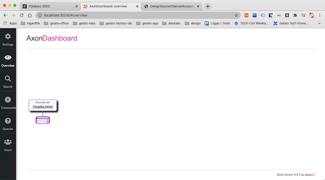
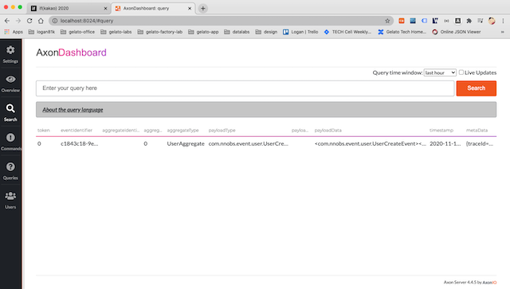

# Event Sourcing + CQRS

평소에 관심을 가지고 있던 Event Sourcing + CQRS를 구현중.

### Axon server 실행 

```bash
docker run --rm \
    --name axonserver \
    -e AXONIQ_AXONSERVER_DEVMODE_ENABLED=true \
    -p 8024:8024 \
    -p 8124:8124 axoniq/axonserver
```

- Axon Dashboard


- Axon Dashboard overview




### spring boot 실행


### api.http 실행

[api-http](src/main/kotlin/com/nnobs/api/api.http)

```http request
POST http://localhost:8080/users
Content-Type: application/json

{
  "email" : "logan@gmail.com"
}

# response
POST http://localhost:8080/users

HTTP/1.1 200 
Content-Type: text/plain;charset=UTF-8
Content-Length: 36
Date: Wed, 18 Nov 2020 03:46:08 GMT
Keep-Alive: timeout=60
Connection: keep-alive

31673fc3-0462-4596-bd45-bf5c8723109f

Response code: 200; Time: 450ms; Content length: 36 bytes
```

- Axon Dashboard search


